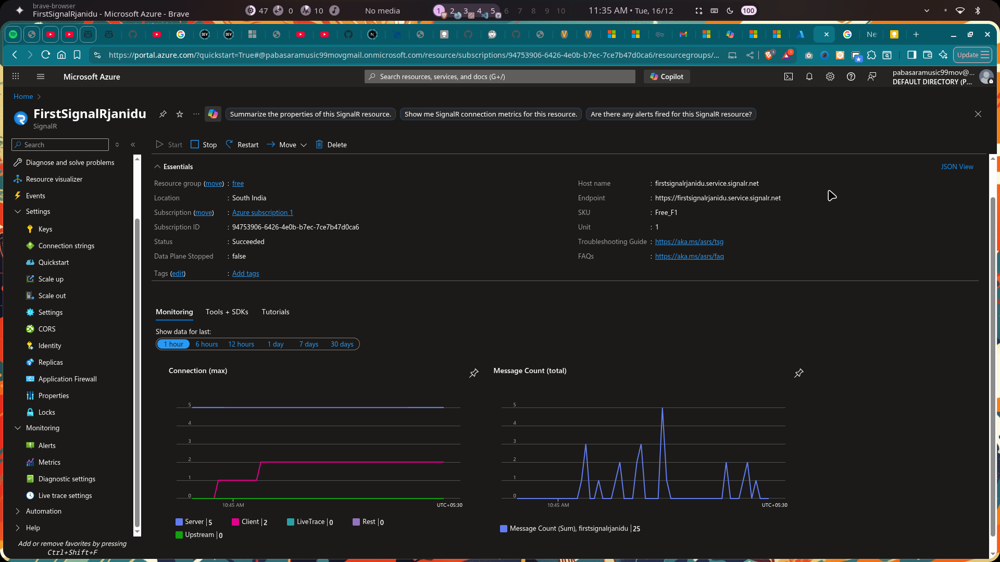
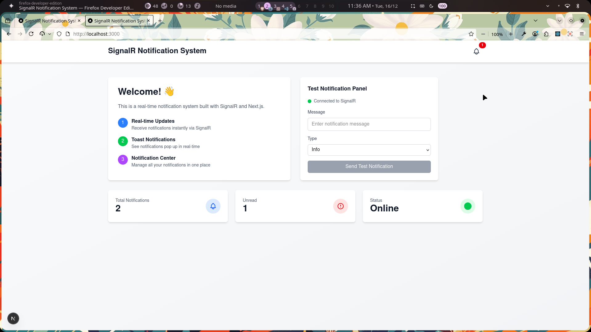
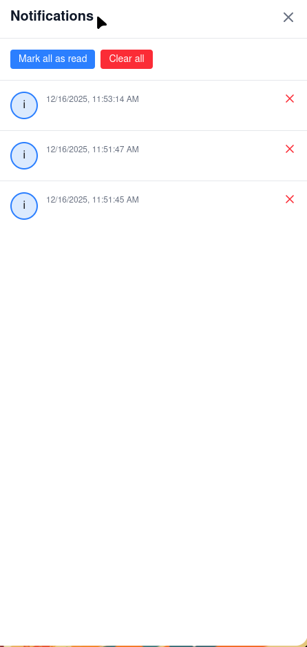
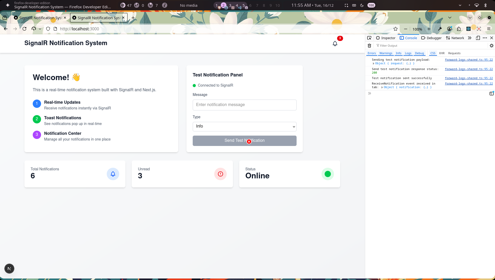
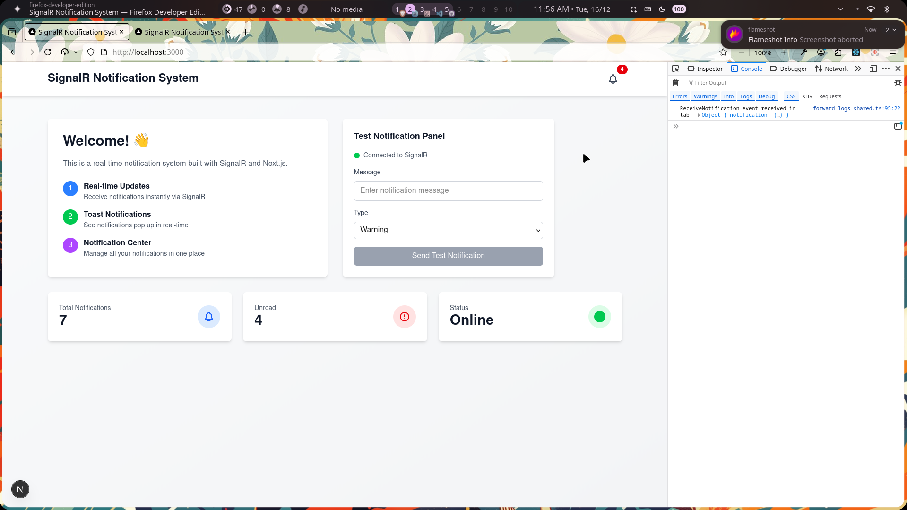

# 🔔 SignalR Notification System

A full-stack real-time notification system built with **Next.js** (React 19), **ASP.NET Core** (.NET 9), and **Azure SignalR Service**, demonstrating production-ready patterns for real-time web applications.

[](https://nextjs.org/)
[](https://reactjs.org/)
[](https://dotnet.microsoft.com/)
[](https://dotnet.microsoft.com/apps/aspnet/signalr)
[](https://www.typescriptlang.org/)

## 📋 Table of Contents

- [Overview](#-overview)
- [Features](#-features)
- [Tech Stack](#-tech-stack)
- [Architecture](#-architecture)
- [Getting Started](#-getting-started)
- [Project Structure](#-project-structure)
- [API Endpoints](#-api-endpoints)
- [SignalR Events](#-signalr-events)
- [Configuration](#-configuration)
- [Screenshots](#-screenshots)
- [Contributing](#-contributing)
- [License](#-license)

## 🎯 Overview

This project demonstrates a production-ready implementation of real-time notifications using SignalR. It showcases:

- **Real-time push notifications** across multiple clients and browser tabs
- **Multi-tab synchronization** - actions in one tab reflect instantly in all tabs
- **Hybrid REST + WebSocket architecture** for efficient communication
- **Azure SignalR Service integration** for scalable cloud deployment
- **In-memory notification management** with broadcast capabilities

### How It Works

1. **User creates a notification** via the Test Panel (REST API call)
2. **Backend stores the notification** in-memory and broadcasts via SignalR Hub
3. **All connected clients receive** the notification in real-time
4. **Toast notification appears**, bell counter updates across all tabs
5. **User actions** (mark as read, clear) are synchronized across all clients

## ✨ Features

### Core Functionality

- ✅ **Real-time Notifications** - Instant delivery using SignalR WebSocket connections
- ✅ **Multi-tab Synchronization** - Changes in one tab reflect in all open tabs
- ✅ **Toast Notifications** - Non-intrusive popup alerts with auto-dismiss
- ✅ **Notification Center** - Centralized panel for managing notifications
- ✅ **Read/Unread Tracking** - Mark individual or all notifications as read
- ✅ **Clear Functionality** - Remove single or all notifications
- ✅ **Type Categorization** - Support for Info, Success, Warning, and Error types
- ✅ **Connection Status** - Real-time connection indicator

### UI/UX Features

- 🔔 Notification bell icon with unread badge counter
- 📱 Sliding notification panel with smooth animations
- 🧪 Test panel for creating sample notifications
- 🌙 Dark mode support with Tailwind CSS
- 📊 Real-time connection status indicator
- ⚡ Optimistic UI updates with instant feedback

## 🛠 Tech Stack

### Frontend

- **[Next.js 16](https://nextjs.org/)** - React framework with App Router
- **[React 19](https://reactjs.org/)** - Latest React with React Compiler
- **[TypeScript](https://www.typescriptlang.org/)** - Type-safe JavaScript
- **[Tailwind CSS 4](https://tailwindcss.com/)** - Utility-first CSS framework
- **[@microsoft/signalr](https://www.npmjs.com/package/@microsoft/signalr)** - SignalR client library

### Backend

- **[ASP.NET Core 9](https://dotnet.microsoft.com/)** - Modern web framework
- **[SignalR](https://dotnet.microsoft.com/apps/aspnet/signalr)** - Real-time communication library
- **[Azure SignalR Service](https://azure.microsoft.com/services/signalr-service/)** - Scalable SignalR hosting
- **C# 12** - Latest C# features

## 🏗 Architecture

```
┌─────────────────────────────────────────────────────────────┐
│                    Frontend (Next.js + React)                │
│                                                               │
│  ┌──────────────┐  ┌──────────────┐  ┌──────────────┐      │
│  │ Test Panel   │  │ Notification │  │   Toast      │      │
│  │ (Create)     │  │ Panel        │  │ Notification │      │
│  └──────┬───────┘  └──────┬───────┘  └──────┬───────┘      │
│         │                  │                  │              │
│         └──────────────────┼──────────────────┘              │
│                            │                                 │
│                    ┌───────▼────────┐                        │
│                    │  useSignalR    │ ← Custom Hook          │
│                    │  Hook          │   (Connection Mgmt)    │
│                    └───────┬────────┘                        │
└────────────────────────────┼─────────────────────────────────┘
                             │
                ┌────────────┼────────────┐
                │            │            │
         REST API         SignalR      WebSocket
         (HTTP)        (Negotiation)  (Real-time)
                │            │            │
                ▼            ▼            ▼
┌─────────────────────────────────────────────────────────────┐
│               Backend (ASP.NET Core + SignalR)               │
│                                                               │
│  ┌──────────────────┐      ┌──────────────────┐            │
│  │  Controllers/    │      │  Hubs/           │            │
│  │  Notifications   │◄────►│  NotificationHub │            │
│  │  Controller      │      │                  │            │
│  └────────┬─────────┘      └────────┬─────────┘            │
│           │                         │                       │
│           └─────────┬───────────────┘                       │
│                     │                                       │
│           ┌─────────▼──────────┐                           │
│           │  Services/         │  ← In-Memory Storage      │
│           │  Notification      │    & Business Logic       │
│           │  Service           │                           │
│           └────────────────────┘                           │
│                                                             │
│           Azure SignalR Service (Optional for Scale)       │
└─────────────────────────────────────────────────────────────┘
```

### Communication Flow

1. **HTTP REST API** - Used for CRUD operations (create, read, update, delete notifications)
2. **SignalR Hub** - Broadcasts real-time updates to all connected clients
3. **WebSocket** - Maintains persistent connection for instant notifications

## 🚀 Getting Started

### Prerequisites

- **Node.js** 20+ and npm/yarn/pnpm
- **.NET SDK** 9.0 or higher
- **Azure SignalR Service** (optional, for cloud deployment)

### Installation

1. **Clone the repository**

   ```bash
   git clone https://github.com/JaniduP2003/SignalR-Notification-System-react.git
   cd SignalR-Notification-System-react
   ```

2. **Setup Backend**

   ```bash
   cd backend
   dotnet restore
   dotnet build
   ```

3. **Configure Azure SignalR** (optional)

   - Create an Azure SignalR Service instance
   - Copy the connection string
   - Update `appsettings.json`:
     ```json
     {
       "Azure": {
         "SignalR": {
           "connectionString": "YOUR_AZURE_SIGNALR_CONNECTION_STRING"
         }
       }
     }
     ```

4. **Setup Frontend**
   ```bash
   cd ../frontend
   npm install
   # or
   yarn install
   # or
   pnpm install
   ```

### Running the Application

1. **Start the Backend** (Terminal 1)

   ```bash
   cd backend
   dotnet run
   ```

   Backend will run on `http://localhost:8080`

2. **Start the Frontend** (Terminal 2)

   ```bash
   cd frontend
   npm run dev
   # or
   yarn dev
   # or
   pnpm dev
   ```

   Frontend will run on `http://localhost:3000`

3. **Open your browser**
   Navigate to `http://localhost:3000`

### Testing Real-time Notifications

1. Open the application in **multiple browser tabs**
2. Use the **Test Panel** to create a notification
3. Observe real-time updates across all tabs
4. Try marking as read or clearing notifications
5. See changes synchronized instantly

## 📁 Project Structure

```
SignalR-Notification-System-react/
├── backend/                          # ASP.NET Core Backend
│   ├── Controllers/
│   │   └── NotificationsController.cs    # REST API endpoints
│   ├── Hubs/
│   │   └── NotificationHub.cs            # SignalR Hub
│   ├── Models/
│   │   └── Notification.cs               # Notification data model
│   ├── Services/
│   │   └── NotificationService.cs        # Business logic & in-memory storage
│   ├── Program.cs                        # Application entry point
│   ├── appsettings.json                  # Configuration
│   └── backend.csproj                    # Project file
│
├── frontend/                         # Next.js Frontend
│   ├── app/
│   │   ├── layout.tsx                    # Root layout
│   │   ├── page.tsx                      # Home page
│   │   └── globals.css                   # Global styles
│   ├── components/
│   │   ├── NotificationBell.tsx          # Bell icon with badge
│   │   ├── NotificationPanel.tsx         # Notification list panel
│   │   ├── TestPanel.tsx                 # Testing interface
│   │   └── ToastNotification.tsx         # Toast popup
│   ├── hooks/
│   │   └── useSignalR.ts                 # SignalR connection hook
│   ├── types/
│   │   └── notification.ts               # TypeScript interfaces
│   ├── package.json                      # Dependencies
│   └── next.config.ts                    # Next.js configuration
│
├── PROJECT_README.md                 # Detailed technical documentation
└── README.md                         # This file
```

## 🔌 API Endpoints

### REST API

| Method   | Endpoint                       | Description               |
| -------- | ------------------------------ | ------------------------- |
| `GET`    | `/api/notifications`           | Get all notifications     |
| `POST`   | `/api/notifications`           | Create a new notification |
| `PUT`    | `/api/notifications/{id}/read` | Mark notification as read |
| `DELETE` | `/api/notifications/{id}`      | Delete a notification     |
| `DELETE` | `/api/notifications/clear`     | Clear all notifications   |

### Request/Response Examples

**Create Notification**

```bash
curl -X POST http://localhost:8080/api/notifications \
  -H "Content-Type: application/json" \
  -d '{
    "title": "New Message",
    "message": "You have a new message!",
    "type": "Info"
  }'
```

**Response**

```json
{
  "id": "550e8400-e29b-41d4-a716-446655440000",
  "title": "New Message",
  "message": "You have a new message!",
  "type": "Info",
  "isRead": false,
  "timestamp": "2025-12-16T10:30:00Z"
}
```

## 📡 SignalR Events

### Server → Client Events

| Event                     | Payload        | Description                 |
| ------------------------- | -------------- | --------------------------- |
| `ReceiveNotification`     | `Notification` | New notification created    |
| `NotificationRead`        | `string (id)`  | Notification marked as read |
| `NotificationCleared`     | `string (id)`  | Notification deleted        |
| `AllNotificationsCleared` | -              | All notifications cleared   |

### Client Implementation

```typescript
// Subscribe to events
connection.on("ReceiveNotification", (notification: Notification) => {
  // Handle new notification
});

connection.on("NotificationRead", (notificationId: string) => {
  // Handle notification marked as read
});
```

## ⚙️ Configuration

### Backend Configuration (`appsettings.json`)

```json
{
  "Logging": {
    "LogLevel": {
      "Default": "Information",
      "Microsoft.AspNetCore": "Warning"
    }
  },
  "AllowedHosts": "*",
  "Azure": {
    "SignalR": {
      "connectionString": "YOUR_CONNECTION_STRING_HERE"
    }
  }
}
```

### Frontend Environment Variables

Create a `.env.local` file in the `frontend` directory (optional):

```env
NEXT_PUBLIC_API_URL=http://localhost:8080
```

### CORS Configuration

The backend is configured to allow requests from `http://localhost:3000`. To modify:

```csharp
// Program.cs
builder.WithOrigins("http://localhost:3000", "https://your-domain.com")
```

## 📸 Screenshots

### 1. Main Application Interface


_SignalR dashbord in Azure_

### 2. Real-time Notification Toast


_Non-intrusive toast notification popup that appears when a new notification is received in real-time._

### 3. Notification Panel - Open View


_Sliding notification panel showing all notifications with mark as read and clear functionality. Features unread indicators and action buttons._

### 4. Multi-tab Synchronization


_console showing the console when you add a notification_

### 5. Connected Status & Test Panel


_this is the console update when the other tab gets updated_

## 🧪 Testing

### Manual Testing Checklist

- [ ] Create notification - appears in all tabs
- [ ] Mark as read - updates in all tabs
- [ ] Clear notification - removes from all tabs
- [ ] Clear all notifications - clears in all tabs
- [ ] Toast notifications - appear and auto-dismiss
- [ ] Connection status - shows connected/disconnected
- [ ] Multi-tab synchronization works
- [ ] Unread counter updates correctly

### Load Testing

You can test with multiple clients by opening the app in multiple browser windows/tabs.

## 🐛 Troubleshooting

### Common Issues

**SignalR Connection Failed**

- Ensure backend is running on `http://localhost:8080`
- Check CORS settings in `Program.cs`
- Verify Azure SignalR connection string (if using)

**Notifications Not Appearing**

- Check browser console for errors
- Verify SignalR connection is established (green indicator)
- Ensure backend NotificationHub is registered

**Port Already in Use**

- Backend: Change port in `Program.cs` → `UseUrls("http://localhost:XXXX")`
- Frontend: Run `npm run dev -- -p 3001` to use a different port

## 🚀 Deployment

### Backend Deployment

**Azure App Service**

```bash
dotnet publish -c Release
# Deploy to Azure App Service
```

**Docker**

```dockerfile
FROM mcr.microsoft.com/dotnet/aspnet:9.0
WORKDIR /app
COPY --from=build /app/publish .
ENTRYPOINT ["dotnet", "backend.dll"]
```

### Frontend Deployment

**Vercel** (Recommended for Next.js)

```bash
npm run build
vercel --prod
```

**Docker**

```dockerfile
FROM node:20-alpine
WORKDIR /app
COPY package*.json ./
RUN npm ci --only=production
COPY . .
RUN npm run build
CMD ["npm", "start"]
```

## 🤝 Contributing

Contributions are welcome! Please feel free to submit a Pull Request.

1. Fork the repository
2. Create your feature branch (`git checkout -b feature/AmazingFeature`)
3. Commit your changes (`git commit -m 'Add some AmazingFeature'`)
4. Push to the branch (`git push origin feature/AmazingFeature`)
5. Open a Pull Request

## 📝 License

This project is licensed under the MIT License - see the [LICENSE](LICENSE) file for details.

## 👤 Author

**Janidu Prasanga**

- GitHub: [@JaniduP2003](https://github.com/JaniduP2003)

## 🙏 Acknowledgments

- [Microsoft SignalR Documentation](https://docs.microsoft.com/aspnet/core/signalr/introduction)
- [Next.js Documentation](https://nextjs.org/docs)
- [Azure SignalR Service](https://azure.microsoft.com/services/signalr-service/)

## 📚 Additional Resources

- [Detailed Technical Documentation](./PROJECT_README.md)
- [SignalR Client API](https://docs.microsoft.com/javascript/api/@microsoft/signalr/)
- [Next.js App Router](https://nextjs.org/docs/app)

---

<p align="center">Made with ❤️ using Next.js and .NET</p>
